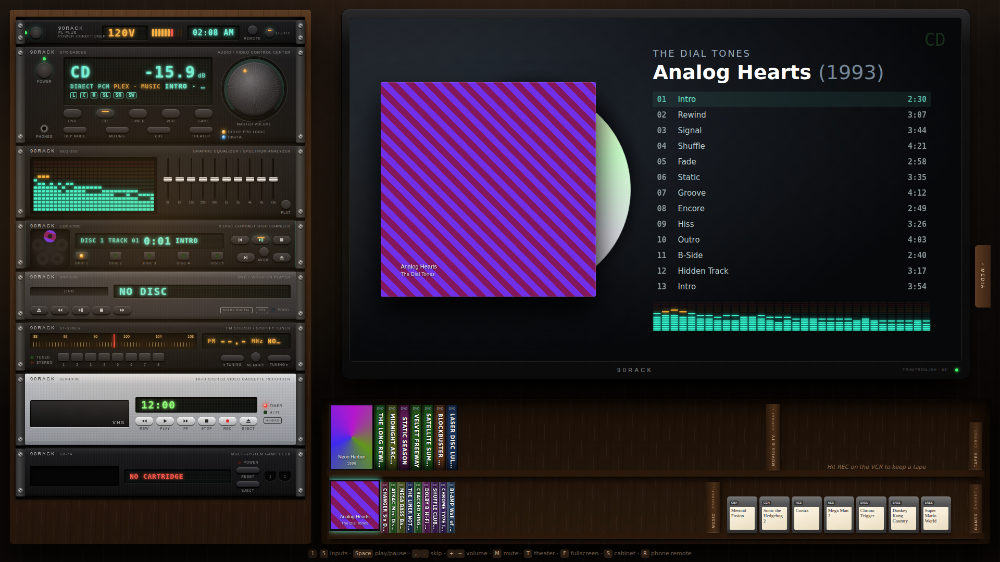

# 90RACK



A 90s hi-fi rack for your modern library. One big TV, a wall of black
brushed-metal components with glowing VFD displays, and a shelf of CDs, DVDs,
tapes and cartridges. It all plays your own stuff:

| Component | Faceplate | Source | What you get |
| --- | --- | --- | --- |
| **DVD player** | DVP-S90 | Plex (Movies & TV) | Keep-case shelf, continue watching, seasons & episodes, resume and watched status sync back to Plex, bouncing DVD screensaver |
| **5-disc CD changer** | CDP-C590 | Plex (Music) | CD tower of jewel cases, a carousel that actually rotates, shuffle / repeat, rolls on to the next disc like a real changer |
| **Tuner** | ST-S90ES | Spotify | Your playlists become FM presets 1–8 on the dial; the rack becomes a Spotify Connect device ("90RACK Tuner") |
| **VCR** | SLV-HF90 | YouTube | Paste a link (or search, with an API key), hit **REC** to save it to your tape shelf, blinking `12:00` |
| **Game deck** | GX-64 | Emulators (EmulatorJS) | NES, SNES, N64, Game Boy/Color/Advance, Genesis, Master System, Game Gear, PlayStation, TurboGrafx, Atari 2600, arcade. Gamepads just work |
| **A/V receiver** | STR-DA90ES | — | Input selector, master volume knob in dB, muting, DSP sound fields (Loudness, Hall, Jazz Club, Stadium) |
| **Graphic EQ** | SEQ-310 | — | A real 10-band EQ and a live spectrum analyzer on everything coming from Plex |
| **Power conditioner** | PL-PLUS | — | Power switch, clock, and the rack lights |

Under the TV is a wall of shelves: DVD and box-set spines, VHS tapes, CD
spines and game cartridges standing up. Hover a spine to see the cover,
click to play it. A shelf holds the things you've pinned (★ in the cabinet,
or on the phone), then what you've played lately, then what's newest in your
library. Everything else is in the cabinet: the drawer that slides out with
your whole library. Right-click a pinned item on the shelf to take it down.
Pins and history live in `data/shelves.json` on the server, so the rack and
your phone see the same shelves.

Nothing is required: without any config the rack boots with demo discs so you
can see it working, then you wire up sources one at a time.

## Quick start

Needs Node 22+.

```bash
npm install
cp .env.example .env     # fill in what you have (see below)
npm run build
npm start                # → http://127.0.0.1:9090
```

Press **POWER** (or Enter) and the rack warms up.

For hacking on it, `npm run dev` runs the same server with hot reload.

## Wiring up your sources

All config lives in `.env`. Restart the server after changing it.

### Plex → DVD player & CD changer

```env
PLEX_URL=http://192.168.1.10:32400
PLEX_TOKEN=xxxxxxxxxxxxxxxxxxxx
```

Find your token with [Plex's guide](https://support.plex.tv/articles/204059436).
The token stays on the server: the browser only ever talks to `/plex/*` on
the rack, which forwards to your server. That also means no CORS or
mixed-content problems.

Video goes through Plex's transcoder as HLS, so MKV/HEVC/DTS files all play
in the browser (Plex direct-streams when it can). Music streams the original
file; FLAC, MP3, AAC and Opus all play in Chrome.

### Spotify → Tuner

Needs Spotify **Premium** (a Spotify rule for in-browser playback).

1. Create an app at <https://developer.spotify.com/dashboard>.
2. Tick **Web API** and **Web Playback SDK**.
3. Add the redirect URI `http://127.0.0.1:9090/callback` (match your `PORT`).
4. Put the app's Client ID in `.env`:

   ```env
   SPOTIFY_CLIENT_ID=your-client-id
   ```

5. Switch the receiver to **TUNER** and press **Connect Spotify**.

Spotify streams are DRM-protected, so use a browser with Widevine: Chrome,
Edge, or Raspberry Pi OS's Chromium all work; some stripped-down Linux
Chromium builds don't.

Your first 8 playlists become presets 1–8. You can also pick "90RACK Tuner"
as the playback device from Spotify on your phone and use that as the remote.

> Spotify only allows plain `http://` redirect URIs on the loopback address,
> so open the rack at `http://127.0.0.1:9090`, not `localhost` and not a LAN
> IP. To use the tuner from another machine, put the rack behind HTTPS and
> register that callback URL instead.

### YouTube → VCR

Pasting a YouTube link (video or playlist) works with no setup. To also get
search, create a **YouTube Data API v3** key in Google Cloud and add:

```env
YOUTUBE_API_KEY=your-key
```

Saved tapes live in the browser's local storage.

### Emulators → Game deck

Point `ROMS_DIR` at your ROMs, one folder per system:

```
roms/
  nes/        *.nes
  snes/       *.sfc *.smc
  n64/        *.z64 *.n64
  gb/ gbc/ gba/
  genesis/    *.md *.gen
  sms/ gg/
  psx/        *.cue + *.bin, *.chd, *.pbp
  pce/ atari2600/ arcade/
```

`.zip` files work too as long as they're in the right system folder. You can
also drag a ROM file onto the cartridge drawer to play it once. Use ROMs you
own.

Emulation is [EmulatorJS](https://emulatorjs.org) (RetroArch cores compiled
to WebAssembly), loaded from its CDN the first time you play each system.
Save states and in-game saves are kept in the browser. Some systems (PSX
especially) run better with a BIOS; see the EmulatorJS docs.

## The remote

Any keyboard, or an HTPC / air-mouse remote that sends keys:

| Key | Does |
| --- | --- |
| `1`–`5` | DVD, CD, TUNER, VCR, GAME |
| `Space` / `K` / ⏯ | Play / pause |
| `.` `,` / ⏭ ⏮ | Next / previous (or skip ±30s on the DVD) |
| `L` `J` | Seek ±10s |
| `+` `-` / 🔊 | Volume |
| `M` | Muting |
| `E` | Eject |
| `S` | Open / close the cabinet |
| `T` | Theater mode (just the TV) |
| `C` | CRT scanlines |
| `F` | Fullscreen |
| `P` | Power |
| `R` | Show the phone-remote QR code |

While a game is running, keys go to the game. Click outside the TV to get
the remote back.

## Phone remote

Set `HOST=0.0.0.0` in `.env` and restart. Press **REMOTE** on the power
conditioner (or `R`) and scan the QR code with your phone (it needs to be on
the same Wi-Fi). You get an RC-90 universal remote: power, inputs, volume
rocker, transport, theater/CRT/DSP, the 5 CD slots, plus your shelves. Browse
or search your whole library from the phone and tap something to play it on
the TV. Use "Add to Home Screen" so it opens full screen like an app.

Browsers only allow sound after someone clicks the page. If the rack has
never been clicked and you start something from the phone, the TV shows
"Click to start sound" (and the phone tells you). Clicking once fixes it for
the session; on a dedicated TV box the `--autoplay-policy` flag below fixes
it for good.

## Running it on the actual TV

The nicest setup is a small PC or Raspberry Pi 5 plugged into the TV running
the rack in a kiosk browser:

```bash
npm start &
chromium --kiosk --autoplay-policy=no-user-gesture-required http://127.0.0.1:9090
```

The TV box itself should keep opening `http://127.0.0.1:9090` (Spotify's
login needs that), while your phone uses the LAN address from the QR code.
`HOST=0.0.0.0` serves both at once.

## How it fits together

```
server/index.js      one small Node server: serves the UI, proxies Plex, lists/serves ROMs,
                     relays the phone remote, stores shelf pins
server/systems.js    which ROM folders/extensions go to which emulator core
public/emu.html      the EmulatorJS host page the game deck loads in an iframe
src/store.ts         rack state: power, input, volume, what's loaded in each deck
src/audio.ts         Web Audio chain: EQ → loudness/reverb DSP → master → analyser
src/rack.tsx         power conditioner, receiver, equalizer
src/shelves.ts       what's on display: pins, play history, recently added
src/components/MediaWall.tsx   the shelves under the TV
src/remoteLink.ts    rack side of the phone remote
src/remote/          the phone remote page (/remote)
src/decks/*.tsx      one file per source: its TV screen, faceplate and shelf
src/sources/*.ts     Plex, Spotify and YouTube API clients
```

Every deck stays mounted while you switch inputs, and the receiver pauses the
deck you switch away from, like a real source selector. The EQ and DSP only
touch Plex audio: Spotify and YouTube play inside their own sandboxed players,
so their spectrum display is simulated from the play state.
